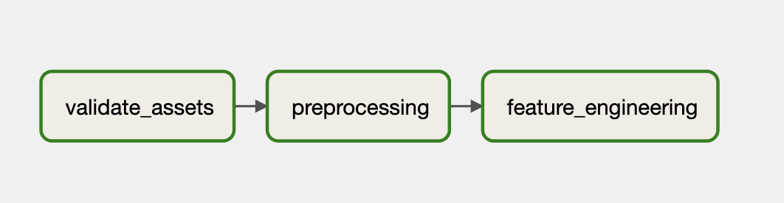
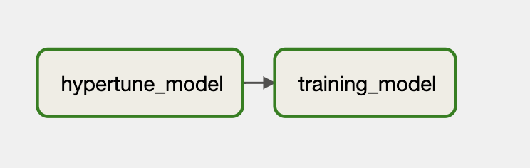

# infra-mlops
Stack: Airflow + Fastapi

## Contenido
1) Estructura del proyecto
2) Etapas del proyecto
3) Endpoint
4) Instalacion y ejecucion
5) Comentarios y mejoras

## Estructura del proyecto

```
├── app                                         # Archivos necesarios para crear el endpoint
│   ├── __init__.py
│   └── main.py  
├── dags                                         # Archivos necesarios para crear el endpoint
│   ├── 1_validation_preprocessing_fe.py
│   └── 2_hypertune_training.py  
├── model
│   ├── steps
│   │   ├── __init__.py
│   │   ├── feature_engineering.py
│   │   ├── preprocessing.py
│   │   ├── training.py
│   │   └── validation.py
│   ├── tests
│   │   ├── validation.py
│   │   │   ├── __init__.py
│   │   │   └── data_munging.py
│   │   └── __init__.py
│   ├── utils
│   │   ├── config.py
│   │   ├── constants.py
│   │   ├── data_munging.py
│   │   └── __init__.py
│   ├── __init__.py
│   ├── schema.yaml
│   └── __main__.py                        
├── artifacts                                   # Guarda los objetos serializados
├── data                                        # Guardar la data
│   ├── features/                          
│   ├── interm/                                 
│   └── raw/                                    # Guarda la data en crudo
├── docker-compose.yml
├── service.Dockerfile
├── airflow.Dockerfile
├── nginx.conf
├── README.md
└── requirements.txt
```
## Etapas del proyecto
- Se realizaron dos dags que contienen un total de 5 steps. 

- El primer dag (1_validation_preprocessing_fe.py) esta enfocado al procesamiento de los datos. Este dag tiene 3 steps: la validacion, preprocesamiento y feature engineering aplicado a los 3 conjuntos de datos. En la validacion se comprueba que la data input siga el mismo esquema, mientras que el preprocesamiento crea las tablas necesarias para que puedan crearse los features que se usaran para entrenar el modelo, y finalmente, el feature engineering crea las variables input del modelo.


- El segundo dag (2_hypertune_training.py) se encarga de entrenar el modelo y encontrar los mejores parametros para el mismo. Asi mismo, crea los artefactos necesarios para que sean usados por el servicio.


## Endpoint
### Health check
Consultar a esta ruta para verificar que el api este activo

**URL** : `localhost:8090/check_service`

**Method** : `GET`

#### Ejemplo

```
curl --location --request GET 'localhost:8090/check_service'
```

#### Respuesta

**Code** : `200 OK`

```json
{
    "Message":"Hello world from service"
}
```

### Prediccion
Consultar por la prediccion de los datos enviados

**URL** : `localhost:8090/get_prediction`

**Method** : `POST`

#### Ejemplo

```
curl --location --request POST 'localhost:8090/get_prediction' \
--header 'Content-Type: application/json' \
--data-raw ' {"data": {
        "anio": [2014.0, 2014.0, 2014.0],
        "mes": [1.0, 2.0, 3.0],
        "Precio_leche": [213.02, 219.03, 227.45],
        "Coquimbo": [3.52467320647237, 1.68885621159928, 2.23720261467365],
        "Valparaiso": [2.3787662295697203, 8.38985389594424, 5.08209415435392],
        "Metropolitana_de_Santiago": [7.27827181044541,
        17.803070451948603,
        5.403087250900849],
        "Libertador_Gral__Bernardo_O_Higgins": [4.80475968850213,
        7.295178298057281,
        15.0252093448195],
        "Maule": [7.83152246846819, 3.01593177929248, 31.2800166809222],
        "Biobio": [33.6840026451552, 22.1861968265569, 78.8543882826541],
        "La_Araucania": [96.70796641882193, 43.1574105715261, 128.113099669829],
        "Los_Rios": [130.212945686754, 65.22801037229, 172.223449588746],
        "PIB_Agropecuario_silvicola": ["55.059.326", "589.162.366", "53.363.658"],
        "PIB_Pesca": ["449.097.098", "530.628.153", "107.007.804"],
        "PIB_Mineria": ["123.408.811", "118.979.099", "127.819.883"],
        "PIB_Mineria_del_cobre": ["110.892.244", "107.686.125", "115.400.625"],
        "PIB_Otras_actividades_mineras": ["125.165.676",
        "112.929.737",
        "124.192.583"],
        "PIB_Industria_Manufacturera": ["125.915.256", "117.324.454", "134.314.265"],
        "PIB_Alimentos": ["323.829.181", "326.848.287", "397.250.136"],
        "PIB_Bebidas_y_tabaco": ["160.131.672", "151.002.582", "156.581.527"],
        "PIB_Textil": ["271.608.802", "24.777.101", "291.436.774"],
        "PIB_Maderas_y_muebles": ["613.149.007", "58.489.291", "663.043.838"],
        "PIB_Celulosa": ["111.186.684", "985.263.519", "102.251.828"],
        "PIB_Refinacion_de_petroleo": ["107.176.547", "987.746.023", "115.536.937"],
        "PIB_Quimica": ["197.004.194", "169.050.011", "197.408.229"],
        "PIB_Minerales_no_metalicos_y_metalica_basica": ["6.795.359",
        "637.721.806",
        "757.357.597"],
        "PIB_Productos_metalicos": ["203.394.915", "182.004.135", "202.930.175"],
        "PIB_Electricidad": ["309.290.133", "276.725.914", "290.911.613"],
        "PIB_Construccion": ["635.812.268", "621.419.201", "710.059.845"],
        "PIB_Comercio": ["10.768.256", "106.567.859", "122.425.043"],
        "PIB_Restaurantes_y_hoteles": ["220.170.996", "21.519.997", "211.265.323"],
        "PIB_Transporte": ["539.108.727", "530.525.285", "561.815.961"],
        "PIB_Comunicaciones": ["364.948.817", "329.424.874", "344.621.056"],
        "PIB_Servicios_financieros": ["603.426.797", "602.969.763", "595.793.932"],
        "PIB_Servicios_empresariales": ["126.672.311", "116.462.931", "117.932.685"],
        "PIB_Servicios_de_vivienda": ["85.785.202", "829.465.384", "825.405.999"],
        "PIB_Servicios_personales": ["787.099.521", "690.060.504", "142.600.046"],
        "PIB_Administracion_publica": ["522.480.077", "523.184.092", "525.208.459"],
        "PIB_a_costo_de_factores": ["102.724.817", "985.454.361", "111.566.458"],
        "PIB": ["112.152.352", "107.497.828", "121.659.577"],
        "Imacec_empalmado": ["976.113.405", "935.602.943", "105.885.915"],
        "Imacec_produccion_de_bienes": ["101.540.937", "982.574.646", "107.308.181"],
        "Imacec_minero": ["977.900.376", "942.799.014", "101.285.403"],
        "Imacec_industria": ["985.915.778", "918.649.843", "105.167.997"],
        "Imacec_resto_de_bienes": ["107.470.632", "107.454.234", "114.516.992"],
        "Imacec_comercio": ["103.244.622", "102.175.861", "11.737.952"],
        "Imacec_servicios": ["93.851.301", "888.267.283", "103.080.921"],
        "Imacec_a_costo_de_factores": ["97.687.997", "9.371.354", "106.096.113"],
        "Imacec_no_minero": ["975.892.915", "934.715.034", "106.453.564"],
        "Indice_de_ventas_comercio_real_no_durables_IVCM": ["943.909.236",
        "928.126.259",
        "101.583.412"]
    }
}'
```

#### Respuesta

**Code** : `200 OK`

```json
{
    "prediction": 230.67016693669638
}
```
## Ejecucion
- Primero, se debe construir y levantar los contenedores
```
docker-compose build
docker-compose up
```
- Para ver los dags, se debe entrar a la UI de airflow a traves de `localhost:8080` y usar como user y password _airflow_
- El api se puede consultar a traves de `localhost:8090`, usando los request de la seccion anterior

## Comentarios y mejoras
- Usar una herramienta de monitoreo. Por cuestion de tiempo, no pude implementarlo en ese proyecto
- En el proyecto pude hacer algunos tests pero hubiese sido mejor poder automatizarlo con una herramienta de CI
- Mejorar las pruebas que se han realizado. Por cuestion de tiempo no pude implementar mas :( 
